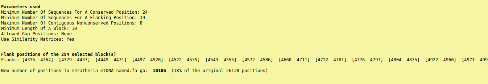
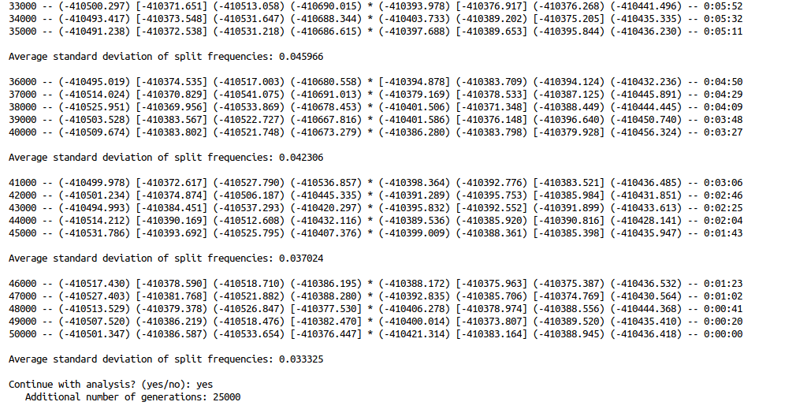

#### Marsupial mtDNA tree construction
1. First, the working directory needs to be organised
```{bash, eval=FALSE}
cd ~/Assignments/Assignment_3
mkdir mb_outputs
mkdir sequences
cd sequences
mkdir nex
mkdir mafft
mkdir gb
```

2. Now, we download the data to be used
```{bash, eval=FALSE}
wget https://university-of-adelaide-bx-masters.github.io/BIOTECH-7005-BIOINF-3000/Practicals/evolutionary_prac/fetch
chmod +x fetch
./fetch -email artemiyhussnain@gmail.com -query "mitochondrion[All Fields] AND \"Metatheria\"[Organism] AND \"complete genome\"[All fields] AND \"RefSeq\"[All fields]" -out metatheria_mtDNA.fa
```

```{bash, eval=TRUE}
head ~/Assignments/Assignment_3/metatheria_mtDNA.fa
```

3. A multiple alignment is produced using MAFFT
``` {bash, eval=FALSE}
mafft --help
mafft metatheria_mtDNA.fa > sequences/mafft/metatheria_mtDNA-mafft.fa
```

```{bash, eval=TRUE}
head ~/Assignments/Assignment_3/sequences/mafft/metatheria_mtDNA-mafft.fa
```

4. The alignment is modified to be usable by Gblocks, a program that removes gaps from the multiple alignment, and fed into it
```{bash, eval=FALSE}
sed -e 's/^>[^ ]\+ \([^ ]\+\) \([^ ]\+\).*$/>\1_\2/g' ~/Assignments/Assignment_3/sequences/mafft/metatheria_mtDNA-mafft.fa > ~/Assignments/Assignment_3/sequences/gb/metatheria_mtDNA-named.fa
mkdir -p screenshots/gb
```
- Gblocks can only be run interactively, so screenshots of terminal output are provided


***
**Q1. What does sed do above?**

- `sed -e` looks for (`'s/`) '>' at the start of a line, followed by anything other than a space (`^>[^ ]`), matches two space-separated instances of anything but a space following that (rest of expression until `/`), and returns the first and second match separated by '_' and preceded by '>' (`>\1_\2`), applying the options globally (`/g`)
***

5. The NEXUS format can be used to visualise multiple alignments produced by MAFFT before proceeding to tree-building using Mr Bayes; Gblocks produces an HTML file with its alignment for visualisation, found at metatheria_mtDNA-named.fa-gb.htm
```{bash, eval=FALSE}
cd sequences/gb
seqmagick convert --output-format nexus --alphabet dna metatheria_mtDNA-named.fa metatheria_mtDNA-named.nex
```

```{bash, eval=TRUE}
head ~/Assignments/Assignment_3/sequences/gb/metatheria_mtDNA-named.nex
head ~/Assignments/Assignment_3/sequences/gb/metatheria_mtDNA-named.fa-gb
```




***
**Q2. What is the reason for the large gaps in the beginning and end of the alignment?**

- One of the features of mitochondrial genomes is the so-called control region, an extremely variable area (especially in the aptly named hypervariable regions) responsible for mitochondrial replication
- Since it is not conserved over long timescales, it is useless for our phylogeny (however, it is extremely useful for studies of human populations over tens of ky)
- Since the circular mtDNA has to be cut somewhere to be stored in databases as a linear sequence, the cut is made in the control region, resulting in the beginning and end of an alignment containing large gaps - the control region length and cut placement varies across species

**Q3. Why does Gblocks need to be used?**

- Gblocks removes large gaps, small gaps, and poorly aligned regions from a multiple alignment, producing an alignment where all sequences are complete and of the same length
- This is a requirement for producing phylogenetic trees later
***

6. Mr Bayes can be used to run a Monte Carlo Markov chain tree reconstruction from the gapless multiple alignment in NEXUS format. A simple, equiprobable nucleotide substitution table is selected. Mr Bayes was also run interactively, so screenshots are provided below.
```{bash, eval=FALSE}
cp metatheria_mtDNA-named.nex ~/Assignments/Assignment_3/mb_outputs/metatheria_mtDNA-named.nex
cd ~/Assignments/Assignment_3/mb_outputs
```


***
**Q4. How many taxa were read into memory?**

- 47 taxa

**Q5. How many characters are being used?**

- Two ways to think about it - either one character, the gapless 10106 bp mtDNA sequence of length for each species; or 10106, the character being the letter at each position

**Q6. What substitution models do the Nst options correspond to?**

- 1 sets all substitution rates to be equal (Jukes-Canter model)
- 2 allows difference in rates of transitions (purine-purine or pyrimidine-pyrimidine) and transversions (purine-pyrimidine) (Kimura or HKY model)
- 6 allows individual letter pair substitution rates to be different (General Time Reversible model)
- In the practical, two bovine trees were constructed using `Nst` set to 1 and 6, and will be compared below
- For the single marsupial tree, model 1 was used
***

- The actual analysis is run with `mcmc` and some parameters




- Note that the analysis is continued at this stage: the "Average standard deviation of split frequencies" was judged to still be steeply decreasing, and the decision to continue was made in accordance with the Mr Bayes [Tutorial](http://mrbayes.sourceforge.net/wiki/index.php/Tutorial_3.2#When_to_Stop_the_Analysis)


- `sump` outputs a variety of parameter summaries for the analysis just completed


***
**Q7, Q8. Describe what the output graph shows. Approximately when does the plateau start in terms of number of samples?**

- The very short burn-in period can be seen: the curve rapidly increases for the first 5000 generations and remains stable from there
- The number of samples is less than the number of generations, and depends on the sampling frequency 
- By default, `Samplefreq` is set to 500, meaning that the burnin should be set to 1000 in `mcmc` options for future analyses
***

- `sumt` generates, in addition to other tree-related summaries, the desired consensus tree, `model-1.con.tre`

```{bash eval=TRUE}
head -n10 ~/Assignments/Assignment_3/mb_outputs/model-1.con.tre
```

7. The consensus tree is visualised using FigTree

Bovine tree, model 1, mitochondrial


Bovine tree, model 6, mitochondrial


Bovine tree, nuclear


Marsupial tree, model 1, mitochondrial


***
**Q9. Do the bovine trees from the two models differ?**

- The branching pattern of trees produced by models 1 and 6 is exactly the same, and so are node probabilities
- The only difference is in the branch length scaling, as demonstrated by this [online tool](https://www.textcompare.org/image/) that finds differences between images


**Q10. How does the branch support differ between the two bovine trees?**

- The node labels were selected to display 'prob' in FigTree, indicating bootstrap support (agreement of the consensus tree on that particular branch with other trees generated in the analysis) for each preceding branch
- The values are identical for all branches in both models

**Q11. Do the bovine trees agree with the known taxonomic groupings?**

- Looking at the first bifurcation in the mitochondrial and nuclear trees, there is broad agreement between the two
- One clade includes the genera *Bos*, *Tragelaphus*, *Taurotragus* in both threes
- The other, bigger clade, includes *Nanger*, *Gazella*, *Oryx*, *Ovis*, *Capra*
- However, there is disagreement beyond this level
- For example, in the mitochondrial tree *Oryx* and *Ovis* are in the same group on the level of second-order bifurcations, but are in different groups in the nuclear tree at the same depth

**Q12. What two species are the best to use as an outgroup in the marsupial tree?**

- *Dasycercus cristicauda* stands out as being extremely distantly related to the rest of the species in the tree, and is an obvious choice for an outgroup to compare relationships between other marsupials
- However, it is so distantly related that one might want a closer outgroup for finer analysis
- The first bifurcation after *D. cristicauda* produces one clade much smaller than the other (species *Mymecobius fasciatus* to *Dasyurus hallucatus* in the figure), and one of these species can be chosen as an outgroup (barring any other biological considerations)

**Q13. Which two leaves are the closest related/have the shortest branch in the marsupial tree?**

- Two species with the shortest distance between them are *Didelphis marsupialis* and *Metachirus nudicaudatus*

**Q14. What is the evolutionary distance between these two leaves?**

- In this phylogram, branch length represents evolutionary distance in units related to sequence divergence, themselves able to be converted to evolutionary time using molecular clock methods
- By comparing to the scale axis, the distance between these species is 0.0079 (sum of branch lengths to the node immediately before them)

**Q15. Which two of the following species in the marsupial tree are most closely related?**
1. **silky-shrew oppossum**
2. **Tasmanian wolf**
3. **koala**
4. **platypus**

- The koala and the silky-shrew oppossum belong to the one half of the second bifurcation, while the Tasmanian wolf belongs to the other, making the first two more closely related (the platypus is not present in this tree)
***